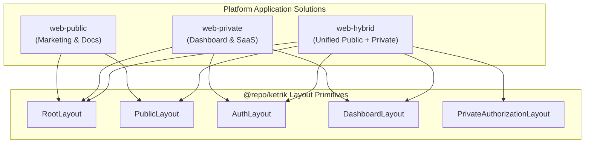

# Application Solutions Overview

The platform is designed around three distinct deployment and architecture solutions: **`web-public`**, **`web-private`**, and **`web-hybrid`**. Each application solution serves specific business, routing, performance, and security requirements.

---

## High-Level Comparison

| Solution          | Target Audience                                                         | Layouts & Routing                                                                                         | Auth / Access Control                                              | Primary Use Cases                                                              |
| :---------------- | :---------------------------------------------------------------------- | :-------------------------------------------------------------------------------------------------------- | :----------------------------------------------------------------- | :----------------------------------------------------------------------------- |
| **`web-public`**  | Unauthenticated public visitors, prospective customers, search crawlers | `RootLayout`, `PublicLayout`                                                                              | None (Publicly open, optimized for SEO & caching)                  | Landing pages, marketing websites, public documentation, knowledge bases       |
| **`web-private`** | Authenticated users, internal teams, admins, enterprise operators       | `RootLayout`, `AuthLayout`, `DashboardLayout`                                                             | Strict authentication required for application areas               | SaaS dashboards, back-office panels, administrative portals, analytics hubs    |
| **`web-hybrid`**  | Unified user journeys requiring seamless public & private transitions   | `RootLayout`, `PublicLayout`, `AuthLayout`, `DashboardLayout`, `PrivateAuthorizationLayout`, `GateLayout` | Dynamic / Per-route (Public front with gated/protected back areas) | All-in-one platforms, unified product + portal sites, multi-tenant hybrid apps |

---

## 1. `web-public` (Public Marketing & Content Portal)

### Overview

`web-public` is optimized for speed, search engine indexing (SEO), and low-latency delivery of public-facing content without authentication overhead.

### Architecture & Routing

- **Layout Model**: Composes `RootLayout` and `PublicLayout`.
- **Routing Scope**: Dynamic catch-all slug matching under `(public)/[[...slugs]]`.
- **Data & Configuration**: Consumes public metadata and navigation registers (`navs.json`, public configs).
- **Key Characteristics**:
    - Zero authentication guard overhead.
    - Highly cacheable static and revalidated pages.
    - Clean public headers, footers, and marketing layout primitives.

---

## 2. `web-private` (Protected Dashboard & SaaS Application)

### Overview

`web-private` is tailored for secure SaaS applications, administrative portals, and management consoles where user authentication and role-based permissions are mandatory.

### Architecture & Routing

- **Layout Model**:
    - `auth/`: Authentication flows (Login, Register, Password Recovery, Verification) wrapped in `AuthLayout`.
    - `(dashboard)/`: Application workspace wrapped in `DashboardLayout`.
- **Routing Scope**: Route group separation between authentication routes (`/auth/*`) and protected application pages (`(dashboard)/[[...slugs]]`).
- **Data & Configuration**: Consumes dashboard schemas, user session context, and protected state management.
- **Key Characteristics**:
    - Full authentication lifecycle management.
    - Dedicated administrative sidebars, navigation drawers, and workspace layouts.
    - Secure state management with isolated session stores.

---

## 3. `web-hybrid` (Unified All-in-One Solution)

### Overview

`web-hybrid` merges the capabilities of `web-public` and `web-private` into a single, cohesive deployment. It enables users to browse public marketing content, sign in, and immediately transition into private dashboard spaces without leaving the application context or domain.

### Architecture & Routing

- **Layout Model**:
    - `(public)/`: Public marketing routes wrapped with `PublicLayout`.
    - `auth/`: Sign-in / Sign-up flows managed by `AuthLayout`.
    - `(private)/`: Authenticated and authorization-gated dashboard routes wrapped in `PrivateAuthorizationLayout` and `DashboardLayout`.
    - `api/` & `gates/`: Gate layouts and server API route handlers.
- **Dynamic Metadata & Multi-Tenancy**:
    - Supports dynamic metadata resolution based on domain/subdomain headers (e.g., multi-tenant customer branding).
    - Integrates chatbot assistants and interactive modules across public and private segments.
- **Key Characteristics**:
    - Complete layout composition (`PublicLayout`, `AuthLayout`, `DashboardLayout`, `GateLayout`).
    - Seamless route transitions from public showcases directly to authenticated features.
    - Single deployment artifact serving both public conversion funnels and secure member features.

---

## Architecture Summary

